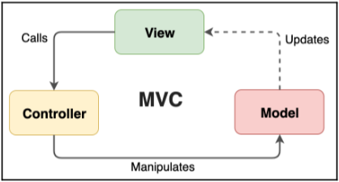

# MVC (Model-View-Controller)

An MVC architecture may involve many individual Models, Views, and Controllers that all work in concert to
solve a given problem. Each of these parts can be described as follows:

- **The Model:** This describes the data and how business logic mutates that data.
  Changes in the data will manifest in changes to the View.
- **The View:** This describes how the Model is rendered (its format, layout, and
  appearance) and will invoke the Controller whenever there is an action that
  needs to occur, possibly in response to a user event.
- **The Controller:** This accepts instructions from the View and informs the Model
  what actions or changes to carry out, which will go on to affect whatever is
  rendered to the user via the View.

The MVC pattern provides us with a way to separate our various concerns.
It prescribes:

- Where we should put logic about business decisions (that is, in Models)

- Where we should put logic about displaying things to the user (that is, Views)

Additionally, it gives us the Controller, which enables these two concerns to talk to each other.
