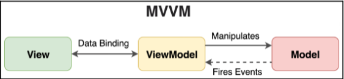

# MVVM (Model-View-ViewModel)

MVVM rescribes a strict separation between the
underlying business logic and data that drives a program and the rendering of that data:

- **The Model:** This describes the data and how business logic mutates that data.
  Changes in the data will manifest in changes to the View.
- **The View:** This describes how the Model is rendered (its structure, layout, and
  appearance) and will invoke the Data Binding mechanism of the ViewModel
  whenever there is an action that needs to occur, possibly in response to a user
  event.
- **The ViewModel:** This is the glue between the Model and the View and enables
  them to talk to each other via a Data Binding mechanism. This mechanism tends
  to vary a lot between implementations.

The relationship between these parts is illustrated in the following diagram:

